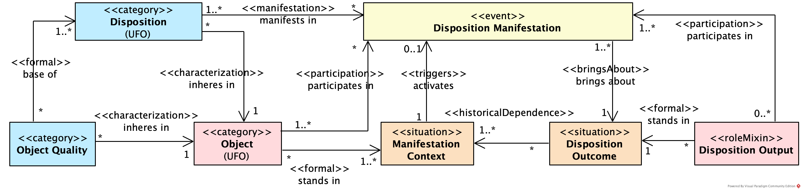
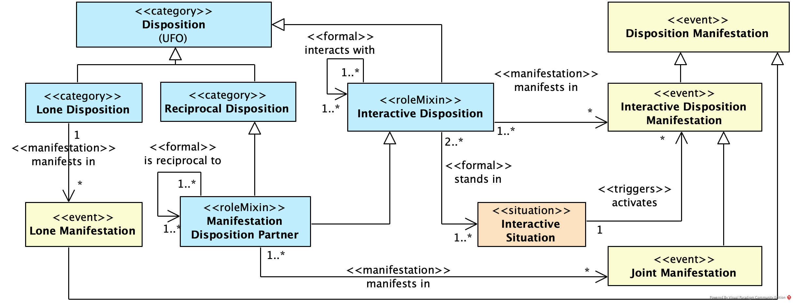
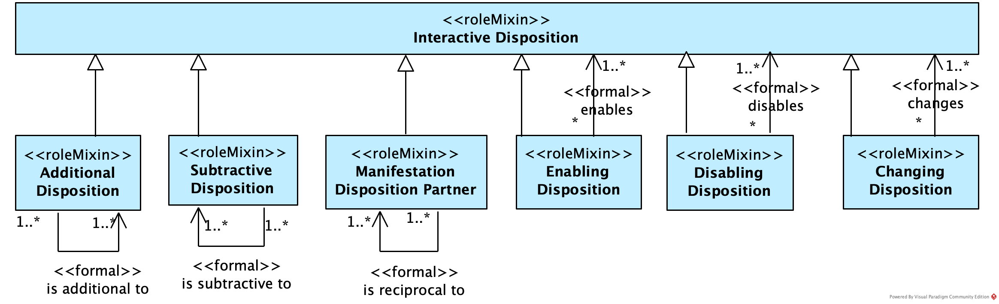
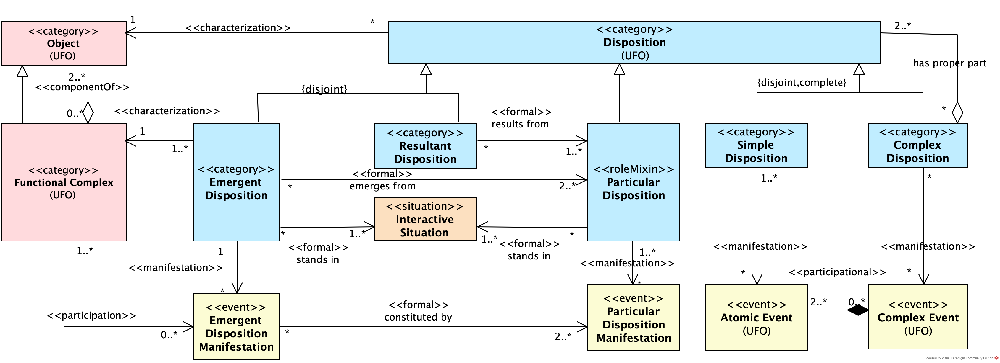
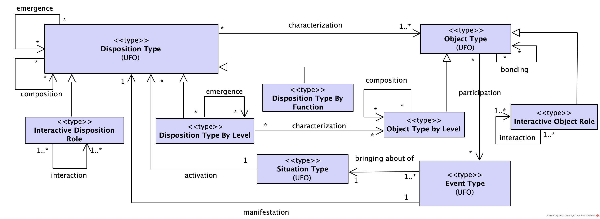

# Disc-O: Disposition Interaction Core Ontology

The design and maintenance of diverse system types are driven by the goal of enabling specific system-wide capabilities while mitigating vulnerabilities. However, achieving and understanding global aspects such as resilience, adaptability, and security is challenging due to their emergent nature. For instance, resilience can manifest through a combination of resistant, flexible, durable, and sometimes even fragile components within a system. To address these challenges, here we propose a disposition core ontology for interrelating dispositions within systems (Disc-O), grounded in system science, emergence explanations, and disposition theories. The ontology aims to enhance the modeling of the emergent dispositions and disposition relationships of systems. By leveraging concepts from Unified Foundational Ontology (UFO) and OntoUML, Disc-O supports a comprehensive understanding of disposition horizontal and vertical relationships. We validate the proposed ontology by applying it in distinct scenarios, especially, socio-technical systems. The objective of Disc-O is to support the interrelation between dispositions (e.g., powers, propensities, vulnerabilities, abilities, capabilities, affordances, etc.). Disc-O includes horizontal and vertical relationships between dispositions. The horizontal ones include relationships related to the combination or integration of dispositions, such as reciprocity, enabling, disabling, change, additionality, and subtraction. The vertical ones include relationships related to the creation of new dispositions based on others, mainly emergence and composition relationships. 

For background information on this core ontology, see:

1. CALHAU, Rodrigo F. et al.; Ontological Foundation for Interrelating Dispositions within Systems, 2025. pre-print available on: http://purl.org/disc/paper

2. CALHAU, Rodrigo F. et al. A system core ontology for capability emergence modeling. In: International Conference on Enterprise Design, Operations, and Computing. Cham: Springer Nature Switzerland, 2023. p. 3-20.

3. CALHAU, Rodrigo F. et al. Modeling competences in enterprise architecture: from knowledge, skills, and attitudes to organizational capabilities. Software and Systems Modeling, p. 1-40, 2024.

4. GUIZZARDI, Giancarlo. Ontological foundations for structural conceptual models. 2005.

Cite this work as: 
R. F. Calhau, J. P. A. Almeida, G. Guizzardi, "Disc-O: Disposition Interaction Core Ontology\\\", 2025, http://purl.org/disc

This work is distributed under Creative Commons Attribution License CC BY 4.0 <https://creativecommons.org/licenses/by/4.0/legalcode>.

For the source repository, see: <https://github.com/disc-onto/ontology>

A reference version in OntoUML ([disposition_ontology.vpp](./disc_ontology.vpp)) and a gUFO-based operational version in OWL [disposition_ontology.ttl](./disposition_ontology.ttl) are included in this repository. 

Both are published following FAIR principles. The reference version in OntoUML is published in the [OntoUML/UFO FAIR catalog](https://scs-ontouml.eemcs.utwente.nl/). The OWL version can be found in [https://purl.org/disc#](https://purl.org/disc). 

To use the OntoUML version, use the [OntoUML Visual Paradigm plugin](https://github.com/OntoUML/ontouml-vp-plugin).

To import Disc-O in Protégé use <https://purl.org/disc#> (using `https` instead of `http`). (This is required in Protégé up to 5.6.1 as it uses a version of the OWL API that is unable to handle multiple http redirects.)

Authors:

* Rodrigo F. Calhau;
* João Paulo A. Almeida;
* Giancarlo Guizzardi.

See <http://purl.org/nemo/doc/gufo> for the foundational ontology employed.

## OntoUML Models

### Core Concepts

### Interactive Disposition

### Emergent Disposition

### Disposition Type

